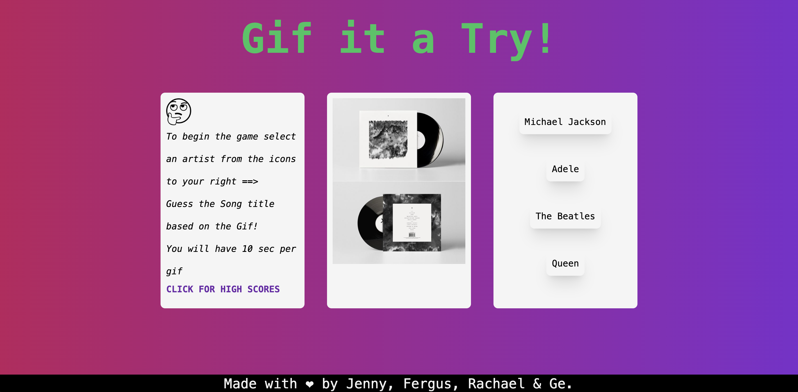
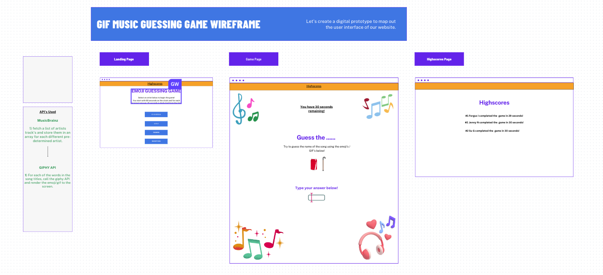

# 07 Project 1: Gif it a Try! Song Guessing Game - Interactive Front-End Application

## Description

Our application is a music trivia game. The game allows the user to select an artist, the game then randomly selects a song title from the artist's works and displays a GIF related to that song. The user must guess the name of the song within 10 seconds and has 5 songs for each artist to try and guess.At the end of the game, the user's score is displayed, and the user can enter their initials to save their score. The game uses the Music Brainz API to retrieve each artist's works and the GIPHY API to translate the song title into a GIFs. The game also stores the user's score in local storage, allowing the user to view their past scores.

## User Story

```md
AS AN entertainer
I WANT to play a game that displays my favourite artists songs and asks me to identitfy the song based on a related giphy video.
SO THAT I can have fun and compete with my friends.
```

## Acceptance Criteria

```md
GIVEN I am taking the "Gif it a Try" quiz
WHEN I click the artist's button,
THEN a 10 second timer starts and a gif that translates a random song title is displayed on screen.
WHEN the user inputs their answer,
THEN the webpage compares their answer with the correct answer. If they match the webpage displays “correct”/”incorrect” in a modal Pop up, respectively.
WHEN the user answers 5 Gif questions, 
THEN the webpage tracks how many answers the user submits correctly, the webpage then displays the user’s score / 5 in a modal pop up
WHEN the game is over,
THEN the user’s score will be stored in the Highscores page so they can see how many they got right and compete with their friends.
```

## Usage
You can use this app by clicking on the artist buttons and starting a new game!
Here is a link to the deployed application:  https://jnaoroji.github.io/group-project1-team-3-Interactive-Front-End-Application/

## Screenshot

The following screenshot shows my web application's appearance and functionality:


## Credits

* https://developer.mozilla.org
* https://day.js.org/en/ 
* https://musicbrainz.org/
* https://developers.giphy.com/dashboard/
* https://developers.giphy.com/explorer/
* https://tailwindui.com/
* 
* This wireframe was used as the predominant guideline for this App.


## License

Please refer to the LICENSE in the repo.

